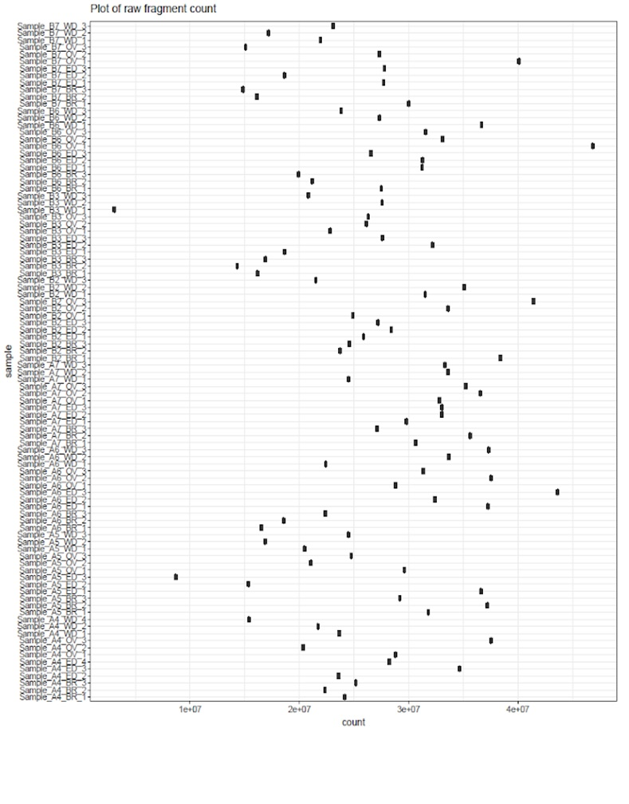
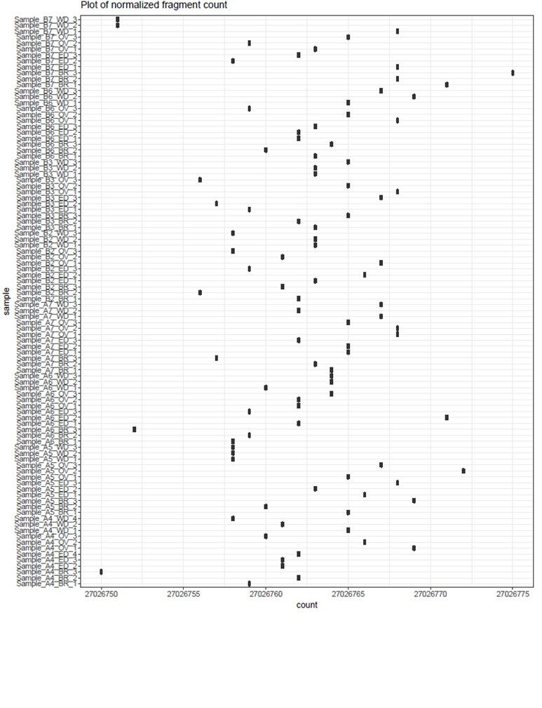

# atacseq

## processing read sequencing data to bam file:

raw reads have their nextera adapter cut with trimgalore which is a wrap for cutadapt. Then, they are aligned with bwa, and have properly paired reads kept.Afterward, I remove orphan reads, read pairs mapping to different chromosomes, and duplicates. The bams files are then convert to bedpe files which have their position shifted via bedtools; the bam files are also have their position shifted directly into new version of bam files via samtools. The bedpe files from corrected bam files don't have their coordinates shifted via bedtools and awk.

Figure A: plot of raw total count of each samples. Y axis is sample name, x axis is the total count

Figure B: plot of normalized total count for each sample. Y axis is sample name, x axis is total count.

Figure C: scatter matrix plot using car package in R to show the scatter plot of raw fragment count for all fragments that are less than 1000 bp in length. The plot shows that all normalized fragment counts between samples have weak relationship and scatters which indicates no normalization. The fragment distributions are different and are also shown in diagonal line of sample names.

Figure C: scatter matrix plot using car package in R to show the scatter plot of normalized fragment count for all fragments that are less than 1000 bp in length. The plot shows that all normalized fragment counts between samples have linear relationship. The fragment distribution after normalization are also shown in diagonal line of sample names.

