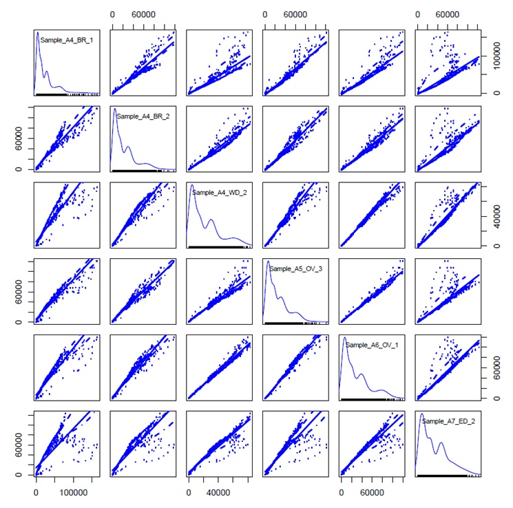
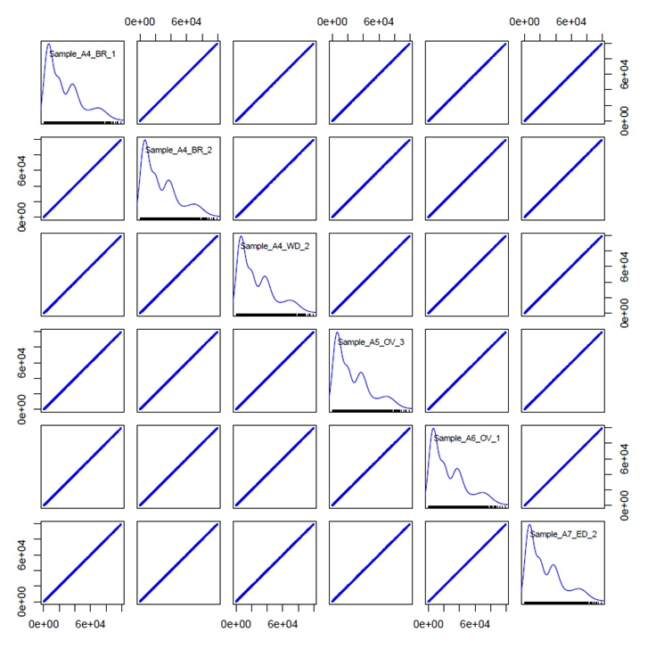

# atacseq

## processing read sequencing data to bam file:

raw reads have their nextera adapter cut with trimgalore which is a wrap for cutadapt. Then, they are aligned with bwa, and have properly paired reads kept.Afterward, I remove orphan reads, read pairs mapping to different chromosomes, and duplicates. The bams files are then convert to bedpe files which have their position shifted via bedtools; the bam files are also have their position shifted directly into new version of bam files via samtools. The bedpe files from corrected bam files don't have their coordinates shifted via bedtools and awk.

After getting bed files, fragment distribution plots are produced, and we decided not to use fat body and embryo samples.

## fragment counts are normalized between 96 samples (no fatbody, not embryo samples):

After getting the bed files, fragment lengths and counts are calculated for all samples.They are also normalized via weight factor which is equal to count/mean count for each fragment length. Here is where I did wrong. Originally, I normalized the read count by mid point base pair when generated vplot instead of whole genome normalization. However, you have pointed this out and it was fixed. All samples are normalized by whole genome now. 

Note: I know you will need some qc steps to validate the normalization so I generate these after normalizing by whole genome. These are scatter plot of all read counts per fragment lengths of each sample:

Figure A: scatter matrix plot using car package in R to show the scatter plot of raw fragment count for all fragments that are less than 1000 bp in length. The plot shows that all normalized fragment counts between samples have weak relationship and scatters which indicates no normalization. The fragment distributions are different and are also shown in diagonal line of sample names.

Figure B: scatter matrix plot using car package in R to show the scatter plot of normalized fragment count for all fragments that are less than 1000 bp in length. The plot shows that all normalized fragment counts between samples have linear relationship. The fragment distribution after normalization are also shown in diagonal line of sample names.

The normalized plot shows the colinear relationship between samples which indicates the successful normalization.
